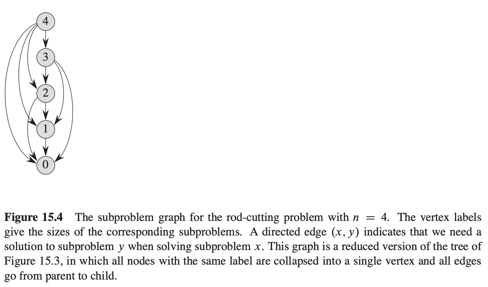

[toc]
# Dynamic Programming 动态规划
This document gives an brief introduction to dynamic programming.

## 动态规划 vs. 分治
动态规划 (dynamic programming, DP) 和分治方法类似，都是通过组合子问题的解来求解原问题(在这里，"programming" 指的是一种表格法，并非编写计算机程序)。

分治方法将问题划分为互不相交的子问题，递归地求解子问题，再将他们的解组合起来，求出原问题的解。

动态规划应用于**子问题重叠**的情况，即不同的子问题具有公共的子子问题（子问题的求解是递归进行的，将其划分为更小的子子问题）。在这种情况下，分治算法会做很多不必要的工作，它会反复地求解那些公共子子问题。而动态规划算法对每个子问题只求解一次，将其解保存在一个表格中，避免了每次求解一个子子问题时都重新计算。

## DP 用途和步骤
动态规划方法通常用来求解**最优化问题** (optimization problem)。这类问题可以有很多可行解，每个解都有一个值，我们希望寻找具有最优值（最大值或最小值）的解。我们称这样的解为问题的一个最优解 (an optimal solution)，而不是最优解 (optimal solution)，因为可能有多个解达到最优值。

通常有以下 4 个步骤设计 DP 算法：
1. 刻画一个最优解的结构特征；（最优子结构）
2. 递归地定义最优解的值；（状态转移方程）
3. 计算最优解的值，通常采用自底向上的方法；
4. 利用计算出的信息构造一个最优解。

步骤 1 ~ 3 是 DP 求解问题的基础。如果仅仅是需要一个最优解的值，而非解本身，可以忽略步骤 4。如果确实需要步骤 4，有时需要在执行步骤 3 的过程中维护一些额外信息，以便构造一个最优解。

> **最优子结构** (optimal substructure) 性质：一个最优决策序列的任何子序列本身一定是相对于子序列的初始和结束状态的最优决策序列，换句话说，问题的最优解由相关子问题的最优解组合而成，而这些子问题可以独立求解。

## DP 设计要素
1. 问题建模：优化的目标函数是什么？约束条件是什么？
2. 如何划分子问题（边界）？
3. 问题的优化函数值与子问题的优化函数值存在着什么依赖关系？（递推关系式）
4. 是否满足优化原则或最优子结构性质？
5. 最小问题怎么界定？其优化函数值，即初值等于什么？

## 两种算法
动态规划方法仔细安排求解顺序，对每个子问题只求解一次，并将结果保存下来。如果随后再次需要此子问题的解，只需查找保存结果，而不必重新计算。因此，DP 是以空间换时间，是典型的时空权衡 (time-memory tradeoff) 的例子。

DP 有两种等价的实现方法：
1. **带备忘的自顶向下法** (top-down with memoization)

此方法仍按自然的递归形式编写过程，但过程会保存每个子问题的解 (通常保存在一个数组或者散列中)。当需要一个子问题的解时，过程会首先检查是否已经保存过此解。如果是，则直接返回保存的值，从而节省计算时间；否则，按通常方式计算这个子问题。称这个递归过程是**带备忘的** (memoized)，因为它“记住”了之前已经计算出的结果。

2. **自底向上法** (bottom-up method)

这种方法一般需要恰当定义子问题“规模”的概念，使得任何子问题的求解只依赖于“更小的”子问题的求解。因此，可以将子问题按照规模排序，按有小到大的顺序进行求解。当求解每个子问题时，它所依赖的那些更小的子问题都已经求解完毕。每个子问题只需求解一次。

两种方法得到的算法具有相同的渐进运行时间，仅有的差异是在某些特殊情况下，自顶向下方法并未真正递归地考察所有可能的子问题。由于没有频繁的递归函数调用的开销，自底向上方法的时间复杂性函数通常具有更小的系数。

### 子问题图
当思考一个动态规划问题时，应该弄清所涉及的子问题及子问题之间的依赖关系。问题的**子问题图**准确地表达了这些信息。

图 15.4 显示了 $n=4$ 时钢条切割问题的子问题图。

它是一个**有向图**，每个顶点唯一地对应一个子问题。在求子问题 $x$ 的最优解是需要直接用到子问题 $y$ 的最优解，那么在子问题图中就会有一条从子问题 $x$ 到子问题 $y$ 的顶点的有向边。

可以将子问题图看做自顶向下递归调用树的“简化版”或者“收缩版”，因为树中所有对应相同子问题的节点合并为图中的单一顶点，相关的所有边都从父结点指向子结点。

自底向上向上的 DP 方法处理子问题图中顶点的顺序为：对于一个给定的子问题 $x$，在求解它之前求解邻接至它的子问题 $y$ (邻接关系不一定是对称的)。用第 22 章中的术语说，自底向上 DP 是按“拓扑逆序” (reverse topological sort) 或“反序的拓扑序” (topological sort of the transpose) (chapter 22.4) 来处理子问题图中的顶点。换句话说，对于任何子问题，直至它依赖的所有子问题均已求解完成，才会求解它。类似的，可以用“深度优先搜索” (depth-first search) (chapter 22.3) 来描述（带备忘机制的）自顶向下动态规划算法处理子问题图的顺序。

子问题图 $G=(V, E)$ 的规模可以帮助我们确定动态规划算法的运行时间。由于每个子问题只求解一次，因此算法运行时间等于每个子问题求解时间之和。**通常，一个子问题的求解时间与子问题图中对应顶点的度（出射边的数目）称正比，而子问题的数目等于子问题图的顶点数。** 因此，*通常情况下，动态规划算法的运行时间与顶点和边的数量称线性关系。*

## 典型问题
|问题|参考书目|
|--|--|
|钢条切割|算法导论15.1|
|矩阵乘法|算法导论15.2|
|最长公共子序列|算法导论15.4|
|最优二叉搜索树|算法导论15.5|
|背包问题|-|
|最短路径问题|-|

## Reference
1. Introduction to Algorithms, 3rd version 算法导论，第三版 
2. 算法设计与分析课程

## 扩展
聚合分析 (aggregate analysis)（算法导论 17.1）

